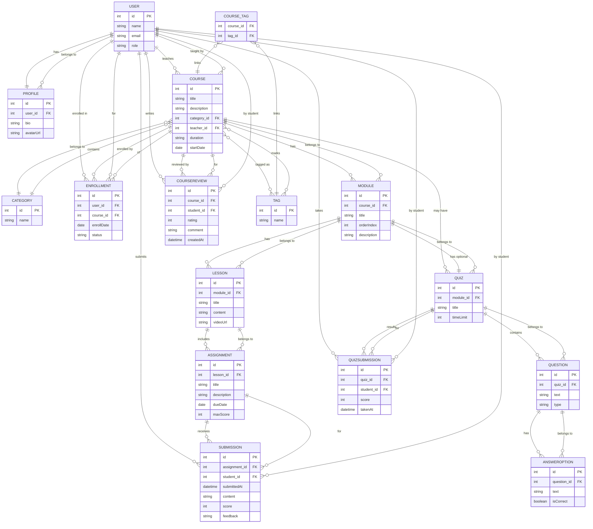

# Учебная платформа ORM / Hibernate

**Учебный проект для закрепления навыков JPA/Hibernate, Spring Boot и реляционных БД.**

---

## Стек технологий

| Категория        | Технологии                                                           |
|------------------|----------------------------------------------------------------------|
| Backend          | **Java 17**, **Spring Boot 3.3**, **Spring Data JPA**, **Hibernate** |
| База данных      | **PostgreSQL 17**, **H2 (тесты)**                                    |
| ORM              | **JPA/Hibernate** (FetchType.LAZY/EAGER, @EntityGraph, join fetch)   |
| Тестирование     | **JUnit 5**, **Spring Boot Test**, **Testcontainers**                |
| Документация API | **springdoc-openapi** (Swagger UI)                                   |
| Сборка           | **Maven 3.9**                                                        |
| Контейнеризация  | **Dockerfile**, **Docker Compose**, **GitHub Actions (CI/CD)**       |

---

## Архитектура проекта

Многослойная структура:

```
com.example.edu_platform
├── domain/              # JPA-сущности
├── repository/          # Spring Data JPA репозитории
├── service/             # Бизнес-логика и транзакции
├── web/                 # REST-контроллеры и DTO
├── exception/           # Исключения домена и ошибок валидации
└── EduPlatformApplication.java
```

**Слои и зависимости:**

* `domain` ↔ `repository` — работа с БД.
* `service` — бизнес-правила, транзакции, валидация, управление lazy-загрузкой.
* `web` — REST API, DTO, `@ControllerAdvice` для ошибок.

---

## Модель данных (ER-диаграмма)

Основные сущности (19 таблиц):

```
User ── Profile
User ──< Course (teacher)
User ──< Enrollment >── Course
Course ──< Module ──< Lesson ──< Assignment ──< Submission >── User
Course ──< Quiz ──< Question ──< AnswerOption
Quiz ──< QuizSubmission >── User
Course ──< CourseReview >── User
Course ──< CourseTag >── Tag
```



Связи:

* **1–1**: User–Profile
* **1–M**: Course–Module, Module–Lesson, Lesson–Assignment
* **M–M**: User–Course (через Enrollment), Course–Tag (через CourseTag)
* Все коллекции (`@OneToMany`, `@ManyToMany`) настроены **LAZY**.

---

## Установка и запуск

### Предварительные требования

* **Java 17+**
* **Maven 3.9+**
* **Docker Desktop** или Podman

### Локальный запуск (без Docker)

1. Подними PostgreSQL:

   ```bash
   docker run -d --name edu-db -e POSTGRES_USER=edu -e POSTGRES_PASSWORD=edu -e POSTGRES_DB=edu -p 5432:5432 postgres:16-alpine
   ```

2. Настрой `application-dev.yml` или передай параметры окружения:

   ```bash
   export DB_URL=jdbc:postgresql://localhost:5432/edu
   export DB_USER=edu
   export DB_PASSWORD=edu
   ```

3. Запусти:

   ```bash
   mvn spring-boot:run -Dspring-boot.run.profiles=dev
   ```

4. Swagger UI:
   [http://localhost:8080/swagger-ui/index.html](http://localhost:8080/swagger-ui/index.html)

---

### Запуск через Docker Compose

```bash
docker compose up -d
```

по умолчанию поднимет:

* `postgres:16-alpine` (порт 5432)
* `edu-platform` (порт 8080)

---

### Демо-данные

При старте (через data.sql) добавляются демо данные (выключить через ENV APP_DEMO_ENABLED=false):
Можно сразу проверить API:

```bash
# Список курсов
curl http://localhost:8080/api/courses

# Зачислить студента
curl -X POST "http://localhost:8080/api/enrollments/courses/1" \
     -H "Content-Type: application/json" \
     -d '{"userId":2}'
```

---

## 🔌 REST API (основные endpoints)

| Метод    | URL                                        | Описание                           |
|----------|--------------------------------------------|------------------------------------|
| **POST** | `/api/courses`                             | Создать курс                       |
| **GET**  | `/api/courses/{id}`                        | Получить курс (с модулями/уроками) |
| **POST** | `/api/courses/{id}/modules`                | Добавить модуль                    |
| **POST** | `/api/modules/{id}/lessons`                | Добавить урок                      |
| **POST** | `/api/lessons/{id}/assignments`            | Добавить задание                   |
| **POST** | `/api/assignments/{id}/submit?studentId=X` | Отправить решение                  |
| **POST** | `/api/submissions/{id}/grade`              | Оценить решение                    |
| **POST** | `/api/modules/{id}/quiz`                   | Создать квиз                       |
| **POST** | `/api/quizzes/{id}/take?studentId=X`       | Пройти тест                        |
| **POST** | `/api/courses/{id}/reviews?studentId=X`    | Оставить отзыв                     |
| **GET**  | `/api/courses/{id}/rating`                 | Средняя оценка курса               |
| **POST** | `/api/enrollments/courses/{id}`            | Зачислить студента                 |
| **GET**  | `/api/enrollments/courses/{id}/students`   | Список студентов курса             |

---

## Тестирование

Проект содержит **интеграционные тесты** (Testcontainers + PostgreSQL) и **юнит-тесты** (Mockito).
Все тесты автоматически запускаются при `mvn verify`.

### Запуск тестов

```bash
mvn verify
```

### Примеры сценариев тестирования:

* **CRUD** для всех сущностей (`User`, `Course`, `Module`, `Lesson`, `Assignment`, `Submission`, `Quiz`, `Review`)
* **Enroll/Unenroll** студентов
* **Submit/Grade Assignment**
* **Take Quiz**
* **LazyInitializationException** тест и его решение (`JOIN FETCH`)
* **Cascade deletion** проверки (курс → модули/уроки)

---

## CI/CD

GitHub Actions выполняет:

* `mvn verify` (unit + integration tests)
* загрузку отчётов (Surefire, JaCoCo)
* сборку Docker-образа и публикацию в **GitHub Container Registry**:

  ```
  ghcr.io/<owner>/<repo>:latest
  ```

---

## Особенности и решения

| Проблема ORM                    | Как решено                                                            |
|---------------------------------|-----------------------------------------------------------------------|
| **LazyInitializationException** | Демонстрационные тесты + использование `@EntityGraph` и `JOIN FETCH`  |
| **Каскадное удаление**          | Курс каскадно удаляет только структуру (модули/уроки), но не прогресс |
| **Уникальность Enrollment**     | Уникальный составной ключ `(student_id, course_id)`                   |
| **Валидация данных**            | Bean Validation (аннотации `@NotNull`, `@Size`, `@Min` …)             |
| **Ошибки API**                  | Централизованный `@RestControllerAdvice` с JSON-ответами              |
| **Чувствительные данные**       | Передаются только через переменные окружения                          |

---

## Быстрый сценарий проверки

1. Запустить проект: `docker compose up -d`
2. Открыть Swagger: [http://localhost:8080/swagger-ui/index.html](http://localhost:8080/swagger-ui/index.html)
3. Выполнить по порядку:

    * `POST /api/courses` → создать курс
    * `POST /api/courses/{id}/modules` → добавить модуль
    * `POST /api/modules/{id}/lessons` → добавить урок
    * `POST /api/lessons/{id}/assignments` → создать задание
    * `POST /api/assignments/{id}/submit?studentId=X` → отправить решение
    * `POST /api/submissions/{id}/grade` → выставить оценку
    * `POST /api/modules/{id}/quiz` + `take` → пройти квиз
    * `POST /api/courses/{id}/reviews?studentId=X` → оставить отзыв
4. Проверить `/api/courses/{id}/rating` — средняя оценка курса.

